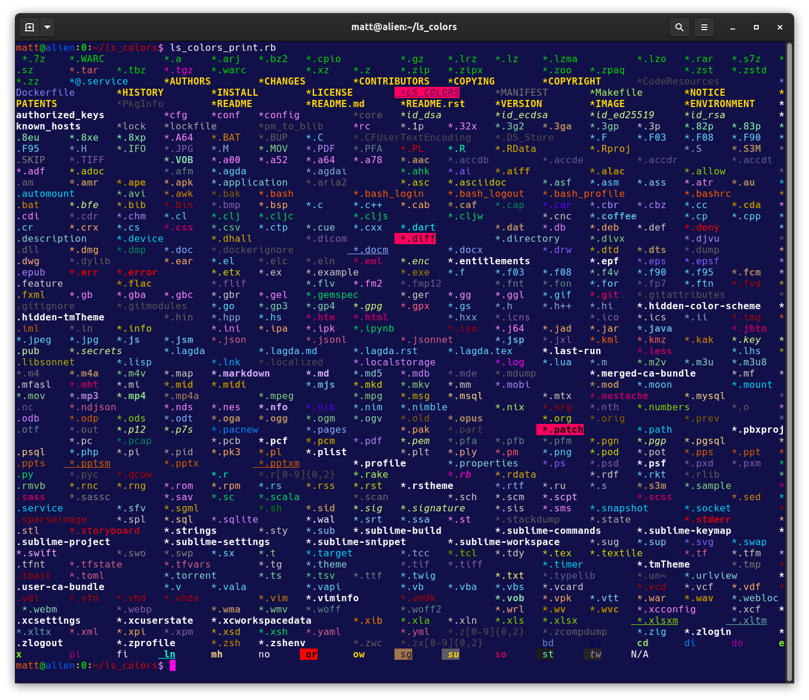

# Colorize your files in the terminal.

matt.a.feenstra@gmail.com

-----



-----

## Information

This has been tested and works on MacOS, RHEL/Fedora/Debian/Ubuntu/Alpine Linux, and all other flavors suporting xterm with 256 colors.  The `LS_COLORS` environment variable is widely interpreted by most \*NIX operating systems and is how directory color is passed to the user's command line terminal.  See the following UNIX man pages `man dircolors` and `man dir_colors` for more information.

## How to use it

Source the `ls_colors.sh` into your environment in  the following ways:

- For your **user**, put in your shell profile.

In this example, for MacOS or Linux, where you use bash shell as your terminal:

_bash shell:_

```sh
echo 'source $HOME/ls_colors/ls_colors.sh' >> $HOME/.bashrc
```

And then reload (ie: `source ~/.bashrc`) or re-login.

- For **system-wide** on RHEL Linux

Place the `ls_colors.sh` in your `/etc/profile.d` folder:

```sh
sudo cp $HOME/ls_colors/ls_colors.sh /etc/profile.d
```

## Modifications

In the interest of customization, I've included `ls_colors_print.rb`.  This snippet will print out each of the colors per file type, and should make it easy to test and play around.  Feel free to branch/fork and contribute to the project.  Thank you!

----

matt.a.feenstra@gmail.com
